# 🚀 Akıllı Portfolio & Admin Panel

ASP.NET Core ile geliştirilmiş, modern UI/UX anlayışı ve yapay zekâ destekli geliştirme süreçleriyle oluşturulmuş
uçtan uca bir **Portfolio & Yönetim Paneli** projesi.

Bu proje; backend mimarisi, admin paneli, canlı istatistikler ve kullanıcı etkileşimini tek bir yapıda
toplayan ölçeklenebilir bir sistem sunar.

---

## 📸 Proje Görselleri

### 🏠 Ana Sayfa & Portfolio UI

  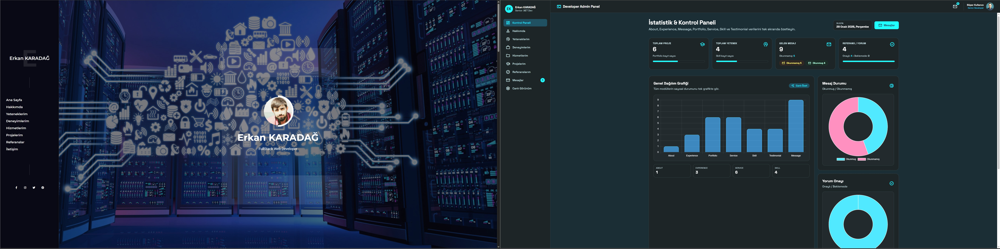

  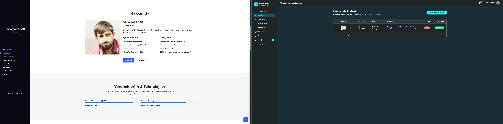

---

  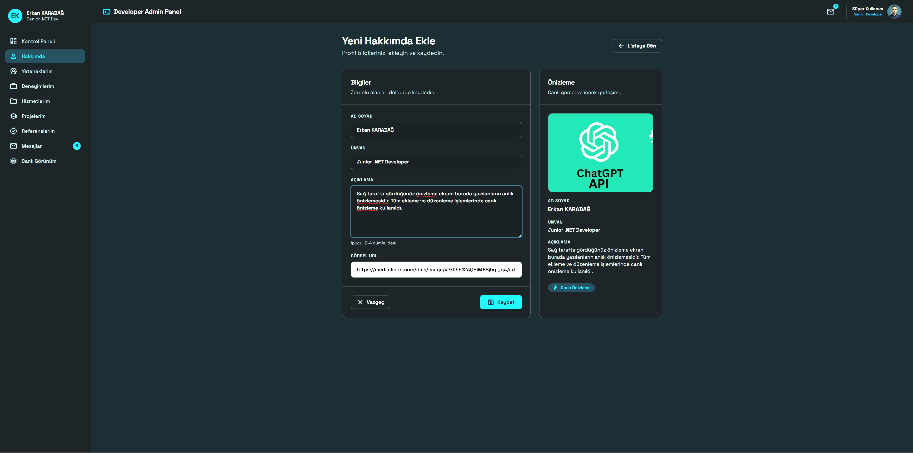

  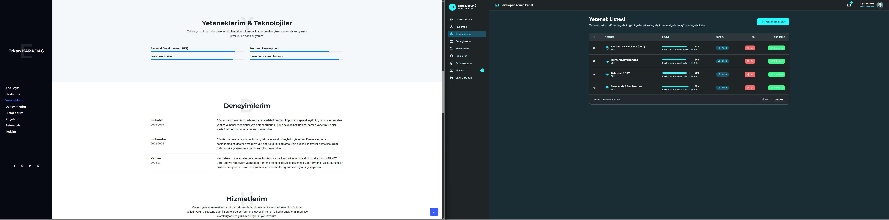

---

  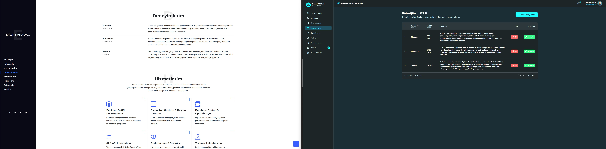

  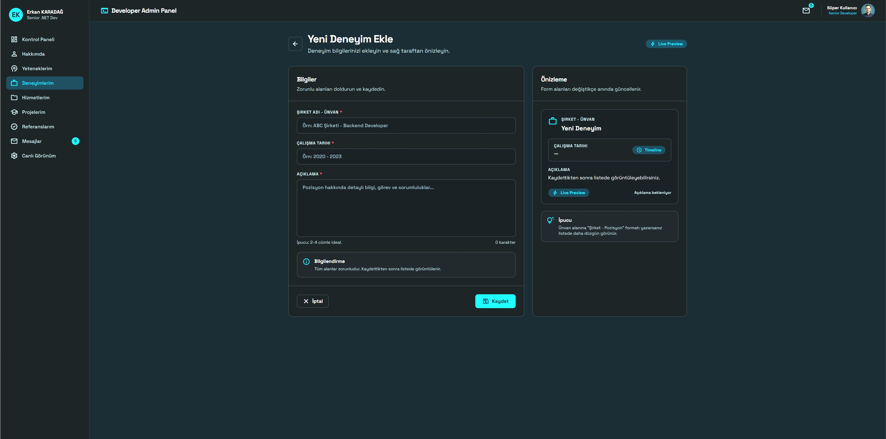

---

  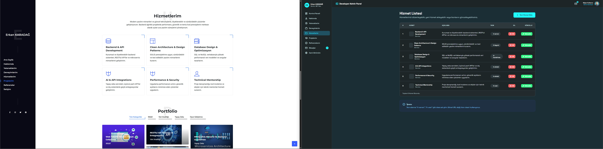

  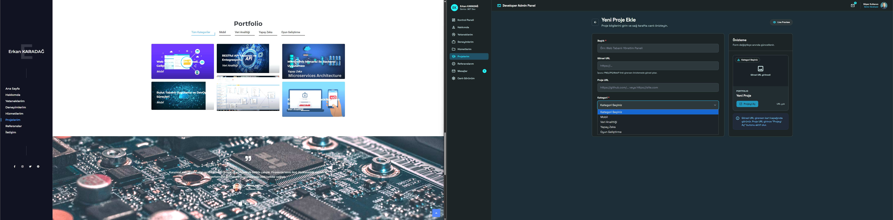

---

  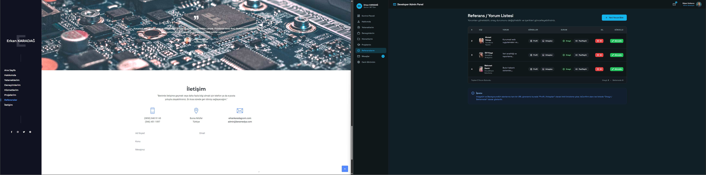

  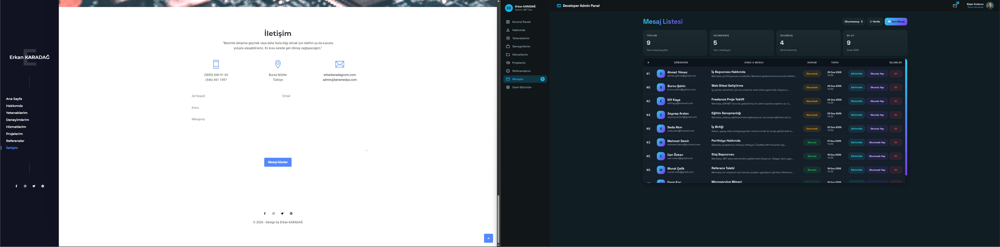

---

  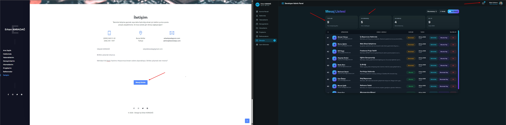

  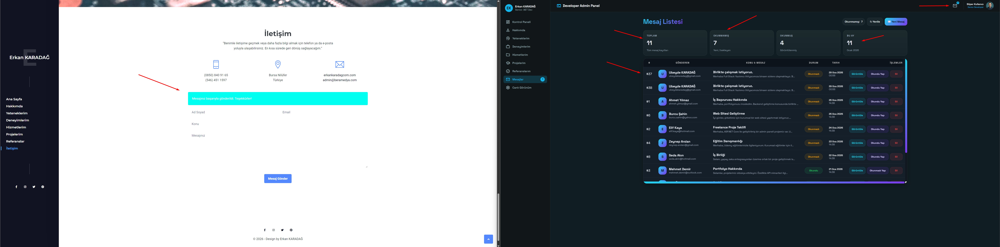

  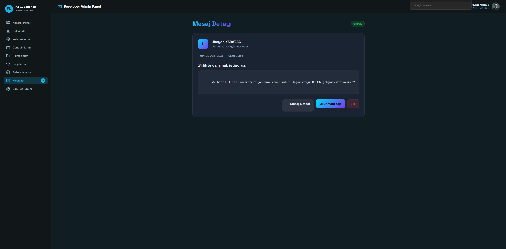

---

## 🧠 Kullanılan Teknolojiler

### Backend
- ASP.NET Core MVC
- Entity Framework Core
- MSSQL
- Repository Pattern
- ViewComponent
- LINQ
- AJAX & JSON
- AntiForgery Token Security

### Frontend
- Razor Pages
- HTML5 / CSS3
- JavaScript
- Chart.js
- Responsive Admin Panel
- Dark Mode UI

### 🤖 Yapay Zekâ Destekli Geliştirme
- **Claude AI** → mimari kararlar, refactoring, backend optimizasyonu
- **Stitch AI** → UI/UX desenleri ve tasarım fikirleri
- AI destekli hata ayıklama ve kod iyileştirme

---

## ✨ Öne Çıkan Özellikler
- 📊 Canlı istatistik & grafik paneli
- ✉️ Okundu / okunmadı mesaj yönetimi
- ⚡ AJAX ile sayfa yenilemeden işlemler
- 🧩 Modüler ve sürdürülebilir mimari
- 🎨 Modern ve profesyonel admin UI
- 🔐 Güvenli form gönderimi
- 📱 Tam responsive tasarım

---

## 🎓 Eğitim & Kazanımlar
Bu projede kullanılan mimari yaklaşımlar ve teknolojiler,
**M&Y Yazılım Eğitim Akademi Danışmanlık** bünyesinde  
**Murat Yücedağ** hocamızın vermiş olduğu eğitimler doğrultusunda
uygulamalı olarak öğrenilmiş ve projeye entegre edilmiştir.

---

## 👤 Geliştirici
**Erkan Karadağ**  

📧 erkankaradagcom@gmail.com  
🔗 LinkedIn: https://www.linkedin.com/in/erkankaradag

---

⭐ Bu projeyi beğendiyseniz yıldızlamayı unutmayın!
